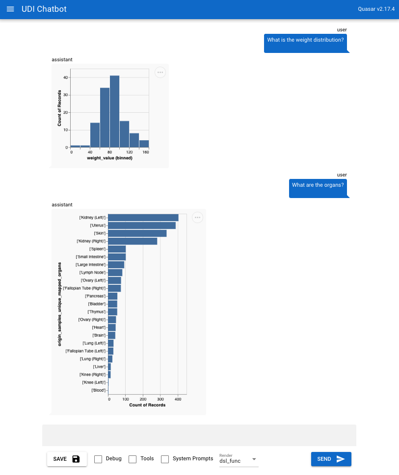

### Universal Discovery Interface Chatbot Prototype

This repository contains the prototype for the Universal Discovery Interface (UDI) chatbot.

The chatbot responds to queries with visualization of the available datasets. This interface is useful as we develop and experiment with the [UDI-Grammar](https://github.com/hms-dbmi/udi-grammar).



## 🚅 Quick start for developers

## Install the dependencies

```bash
yarn
# or
npm install
```

### Start the app in development mode (hot-code reloading, error reporting, etc.)

```bash
quasar dev
```

### Lint the files

```bash
yarn lint
# or
npm run lint
```

### Format the files

```bash
yarn format
# or
npm run format
```

### Build the app for production

```bash
quasar build
```

### Customize the configuration

See [Configuring quasar.config.js](https://v2.quasar.dev/quasar-cli-vite/quasar-config-js).
